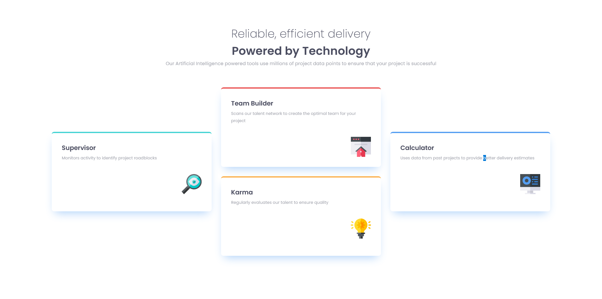

# Frontend Mentor - Four card feature section solution

This is a solution to the [Four card feature section challenge on Frontend Mentor](https://www.frontendmentor.io/challenges/four-card-feature-section-weK1eFYK). Frontend Mentor challenges help you improve your coding skills by building realistic projects. 

## Table of contents

- [Overview](#overview)
  - [The challenge](#the-challenge)
  - [Screenshot](#screenshot)
  - [Links](#links)
  - [Built with](#built-with)
  - [What I learned](#what-i-learned)
  - [Continued development](#continued-development)
  - [Useful resources](#useful-resources)
- [Author](#author)

## Overview

  In this project, I have implement CSS grid to position the four cards in the design and adjust the layout based on screen sizes. In addtion to this, I have also used Semantic HTML and Sass which is a CSS preprocessor.

  For the development, I have used the Desktop-first approach.

### The challenge

Users should be able to:

- View the optimal layout for the site depending on their device's screen size

### Screenshot



### Links

- Solution URL: [https://www.frontendmentor.io/solutions/responsive-four-card-section-using-css-grid-and-flexbox-with-sass-_UQn5VeW37](https://www.frontendmentor.io/solutions/responsive-four-card-section-using-css-grid-and-flexbox-with-sass-_UQn5VeW37)
- Live Site URL: [https://schindlerdumagat.github.io/four-card-feature-section/](https://schindlerdumagat.github.io/four-card-feature-section/)

### Built with

- Semantic HTML5 markup
- CSS custom properties
- Flexbox
- CSS Grid
- Desktop-first workflow
- [Sass](https://sass-lang.com/) - CSS preprocessor

### What I learned

By building this project, I was able to learn how to implement basic CSS grid layout. I was able to customize the layout based on different screen sizes and be able to span the grid items based on the design.

```css
  main {
      display: grid;
      grid-template-columns: repeat(6, 1fr);
      grid-template-rows: repeat(4, 1fr);
      gap: 30px;
  }

  #supervisor {
      grid-area: 2 / 1 / 4 / 3;
      border-top: 4px solid $font-color-cyan;
  }
  
  #team-builder {
      grid-area: 1 / 3 / 3 / 5;
      border-top: 4px solid $font-color-red;
  }
  
  #karma {
      grid-area: 3 / 3 / 5 / 5;
      border-top: 4px solid $font-color-orange;
  }
  
  #calculator {
      grid-area: 2 / 5 / 4 / 7;
      border-top: 4px solid $font-color-blue;
  }
```

### Continued development

I was able to implement CSS grid in this project but I think there are still rooms for improvement. I will read more about CSS grid and layouting in general and better code with CSS Grid.

### Useful resources

- [Web.Dev - CSS Grid](https://web.dev/learn/css/grid?continue=https%3A%2F%2Fweb.dev%2Flearn%2Fcss%2F%23article-https%3A%2F%2Fweb.dev%2Flearn%2Fcss%2Fgrid) - This helped me learn the fundamentals in CSS Grid.
- [W3schools - CSS Grid](https://www.w3schools.com/css/css_grid.asp) - This resource provides some CSS properties you can use with CSS Grid.

## Author

- Website Portfolio - [Schindler Dumagat](https://schindlerdumagat.github.io/webportfolio/)
- Frontend Mentor - [@schindlerdumagat](https://www.frontendmentor.io/profile/schindlerdumagat)
- LinkedIn - [schindlerdumagat](https://www.linkedin.com/in/schindler-dumagat-015238230/)
